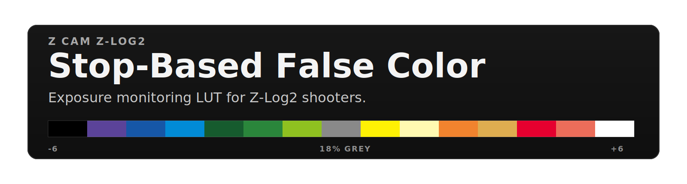
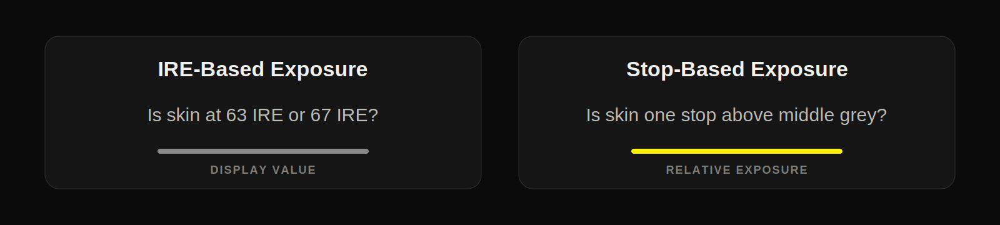
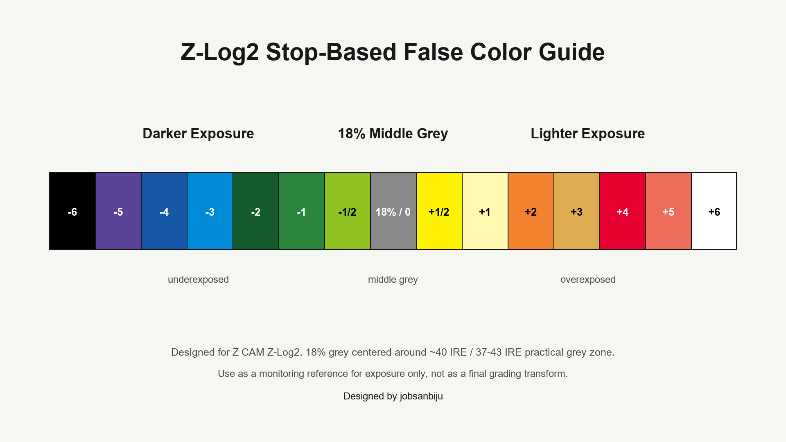

  

  <strong>A stop-based false color monitoring LUT for Z CAM Z-Log2 footage.</strong>

  Designed specifically for exposure evaluation, this LUT visualizes scene exposure relative to <strong>18% middle grey</strong> rather than relying solely on IRE values.

  
    <a href="#overview">Overview</a> |
    <a href="#why-this-exists">Why This Exists</a> |
    <a href="#features">Features</a> |
    <a href="#included">Included</a> |
    <a href="#exposure-reference">Exposure Reference</a> |
    <a href="#technical-foundation">Technical Foundation</a>
  

---

## Overview

> Traditional false color systems are typically built around IRE values.  
> This LUT takes a different approach: it evaluates exposure relative to middle grey in stops.

Inspired by the EL Zone philosophy and built specifically around Z CAM's Z-Log2 curve, this project aims to bring a stop-based exposure workflow to cameras and monitors that do not natively support one.

By decoding Z-Log2 into scene-linear values and assigning exposure zones relative to middle grey, exposure can be evaluated in stops rather than display values.

The result is a monitoring tool designed around exposure placement rather than waveform numbers.

---

## Why This Exists

After using the EL Zone system across multiple camera systems, I found it fundamentally changed how I approached exposure.

Traditional false color systems are usually built around IRE values. While useful, they become harder to interpret when monitoring log footage because log curves are logarithmically encoded. Different log curves place the same scene exposure at different IRE values, making it difficult to develop a consistent exposure workflow across cameras.

A stop-based system approaches the problem differently.

Instead of monitoring display brightness, exposure is evaluated relative to 18% middle grey in stops.

The result is a common exposure language that remains consistent regardless of camera, monitoring transform, or viewing LUT.

  

### What I Learned

- Monitoring exposure in stops is easier and more intuitive than monitoring exposure in IRE.
- Exposure decisions become more consistent across different cameras and log curves.
- Highlight and shadow placement become easier to visualize relative to middle grey.
- Exposure can be communicated in a common language regardless of camera brand.

That shift sounds small, but it fundamentally changes how exposure is evaluated.

I wanted the same workflow for Z CAM Z-Log2.

Using Thatcher Freeman's reverse-engineered Z-Log2 transform as a foundation, this project converts Z-Log2 into scene-linear values before assigning stop-based exposure zones.

The result is a monitoring tool designed specifically around how Z-Log2 behaves, while retaining the simplicity and consistency that make stop-based exposure systems so useful.

---

## Features

<table>
  <tr>
    <td width="50%">
      <strong>Exposure Workflow</strong>
        
      - Stop-based exposure monitoring 
      - 18% middle grey centered around approximately 40 IRE 
      - Practical grey zone around 37-43 IRE 
      - EL Zone-inspired color mapping
    </td>
    <td width="50%">
      <strong>Z-Log2 Monitoring</strong>
        
      - Designed specifically for Z CAM Z-Log2 
      - Minimal sensitivity to white balance changes 
      - Works as a monitoring LUT on cameras and external monitors that support LUT loading
    </td>
  </tr>
</table>

---

## Included

<table>
  <tr>
    <td align="center" width="50%">
      <strong><code>Z-Log2_to_El-Zone-like_jobsanbiju-v1.1.cube</code></strong>
        
      Monitoring LUT. Load onto your monitor and use it as an exposure aid while shooting Z-Log2.
    </td>
    <td align="center" width="50%">
      <strong><code>zlog2_stop_false_color_guide.png</code></strong>
        
      Reference chart showing each exposure zone and its corresponding color.
    </td>
  </tr>
</table>

---

## Exposure Reference

<table>
  <tr>
    <td align="center" width="33%"><strong>Shadows</strong> -6 to -1/2</td>
    <td align="center" width="33%"><strong>18% Grey</strong> Practical 37-43 IRE zone</td>
    <td align="center" width="33%"><strong>Highlights</strong> +1/2 to +6</td>
  </tr>
</table>

  

  For Z CAM Z-Log2, 18% middle grey is centered around approximately 40 IRE, with a practical grey zone around 37-43 IRE.

| Zone | Relative Exposure |
| ---- | ----------------- |
| +6   | Clipping |
| +5   | Extreme Highlights |
| +4   | Very Bright Highlights |
| +3   | Bright Highlights |
| +2   | Light Skin / Bright Surfaces |
| +1   | One Stop Above Middle Grey |
| +1/2 | Half Stop Above Middle Grey |
| 0    | 18% Middle Grey |
| -1/2 | Half Stop Below Middle Grey |
| -1   | One Stop Below Middle Grey |
| -2   | Deep Midtones |
| -3   | Shadows |
| -4   | Deep Shadows |
| -5   | Near Black |
| -6   | Black |

---

## Technical Foundation

Built using Thatcher Freeman's reverse-engineered Z-Log2 transform.

<table>
  <tr>
    <td align="center"><strong>1. Decode</strong></td>
    <td align="center"><strong>2. Measure</strong></td>
    <td align="center"><strong>3. Protect</strong></td>
  </tr>
  <tr>
    <td align="center">Z-Log2 is converted into scene-linear values.</td>
    <td align="center">Exposure is calculated relative to 18% middle grey using the green channel.</td>
    <td align="center">Max RGB is used for clipping detection.</td>
  </tr>
</table>

Development included:

- Validation against Z CAM's published middle-grey placement
- Exposure sweep testing from -6 to +6 stops
- White-balance stability testing from approximately 2500K to 14000K
- Verification against scene-linear exposure adjustments
- LUT validation against the original Resolve node graph

---

## Notes

<table>
  <tr>
    <td align="center"><strong>Monitoring Tool</strong></td>
    <td align="center"><strong>Not a Look LUT</strong></td>
    <td align="center"><strong>Use With Waveform</strong></td>
  </tr>
</table>

> This LUT is intended for monitoring and exposure evaluation only.

- It is not intended as a grading LUT.
- It is not intended as a display transform.
- Best used alongside waveform monitoring.
- Built specifically for Z CAM Z-Log2 footage.

---

## Credits

<table>
  <tr>
    <td align="left">
      Designed and developed by <strong>jobsanbiju</strong>.
        
      Special thanks to <strong>Thatcher Freeman</strong> for his work reverse-engineering the Z-Log2 curve and making that research publicly available to the community.
    </td>
  </tr>
</table>

---

  

<table>
  <tr>
    <td align="center" width="720">
       
      <strong>Support future development, testing, and documentation</strong>
        
      If this LUT has been useful to you, support is completely optional but appreciated.
        
      <a href="https://ko-fi.com/jobsanbiju"><strong>Support on Ko-fi</strong></a>
        
      Contributions help fund future LUTs, DCTLs, camera tools, testing, and educational resources for filmmakers.
        
    </td>
  </tr>
</table>

